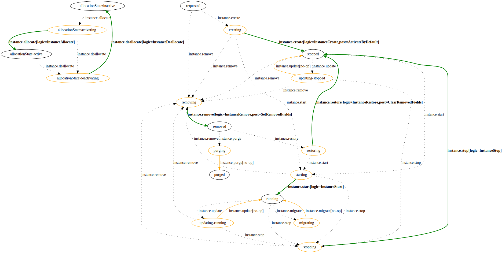

Orchestration
=============

This section describes the underlying concepts on how orchestration is carried out in Cattle.

Resources
*********

The base unit in Cattle is a resource.  Resources are opaque objects that are orchestrated.  What a resources is and what it represents is largely unknown to the core Cattle orchestration system.  The core orchestration system mostly cares about the state, type, and relationship of the resources.

An example of a resource is a volume or IP address.  Instance is the most important resource as it is the generalized concept of either a container or virtual machine.

.. image:: https://docs.google.com/drawings/d/1CVD_XPAEbYUHRKUBQSi5Ml5cCYJ0ctFIWe_qSN61Gbw/pub?w=274&h=219
   :align: center

You can list all the defined resources at http://localhost:8080/v1/resourcedefinitions in the API.

Processes
*********

Once you have defined resources, you can attach processes to the resources.  Processes are what drive the orchestration logic.  You can list all the defined processes at http://localhost:8080/v1/processdefinitions in the API.  One important process is the "instance.start" process which is responsible for starting a virtual machine or container.  For any process you can navigate to the process definition in the API and then follow the "resourceDot" link to get a visual respentation of the process.  For example the "instance.start" process is avaiable at http://localhost:8080/v1/processdefinitions/1pd!instance.start/processdot and looks like below.

.. image:: instance-start.svg
   :align: center

Process are defined as having a start, transitioning, and done state.  All processes are modeled in this fashion.  For a process to be started, it obviously must be in the start state.  Once the process has been started it will update the state to the transitioning state.  For a process to be completed it must move from the transitioning state to the done state.  If there is not logic attached to that transition, the orchestration system will simply update the state and be done.

To make the orchestration system actually perform real operations, you must attach some logic.  In the above diagram you can see that the "InstanceStart" logic has been attached to this process.  One can attached any logic they choose.  This makes the orchestartion system very flexible and extensible.  At any point in the lifecycle of the resources you can plug-in any arbitrary logic.

Once you assign enough states and process to a resource you being to construct a finite state machine for the resource.  You can combine all the processes for a resource into a single view by navigating to the resourceDot link of a resourceDefinition.  For example, the combined process diagram for an instance is available at http://localhost:8080/v1/resourcedefinitions/1rd!instance/resourcedot and looks similar to below.

Process Handler
***************

Process handlers are the way in which you attach logic to a process.  At the lowest level they are Java code that implement the :code:`io.cattle.platform.engine.handler.ProcessHandler` interface.  Instead of writing Java code, you can instead have the orchestration system send out an event that you process handler will respond too.  This means you can add logic in any programming or scripting language.  Refer to :ref:`simpler_handler` for an example of registering an external handlers and how to reply to events.
