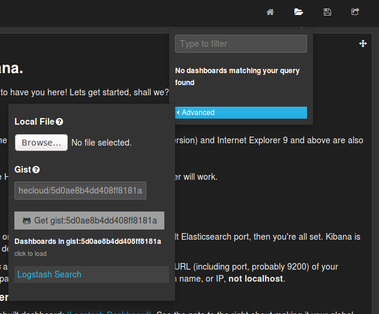

.. _docker-example:

Docker Example
==============

To get a basic overview of how Docker works we will use Docker to deploy a simple multi-tiered application.

.. image:: https://docs.google.com/drawings/d/1jXfAGAb2h0oYGZlRh-ihFWGp2bPvI4M2drOaV3ESrHc/pub?w=402&h=219
   :align: center

The application will we be deploying is dStack itself and additionally log aggregation with Logstash/Elasticsearch and Kibana for the UI.  The full script to run all of the below commands is `dstack-scripts.zip download <https://github.com/ibuildthecloud/dstack/tree/master#1-download>` in docker-example.sh.

Launch Logstash/Elastisearch
****************************

We're going to launch logstash with Elasticsearch embedded.

.. code-block:: bash

    docker run -d --name logstash ibuildthecloud/logstash

Launch Kibana
*************

We will now launch Kibana and link it to the embedded Elasticsearch.

.. code-block:: bash

    docker run -d -p 80 --name kibana --link logstash:es ibuildthecloud/kibana

You can run :command:`docker ps` to see which port Kibana is running on.  You can use gist https://gist.github.com/ibuildthecloud/5d0ae8b4dd408ff8181a as a sample dashboard.

Launch MySQL
************

.. code-block:: bash

    docker run -d -p 80 --name mysql ibuildthecloud/mysql

You can run :command:`docker ps` to see which port phpMyAdmin is running on.  Hit http://localhost:PORT/phpmyadmin and you can login with dstack/dstack for the account.

Launch dStack
*************

Now launch dStack linking it to MySQL and Logstash (using GELF).

.. code-block:: bash

    docker run -d -p 8080 --name dstack --link mysql:mysql --link logstash:gelf ibuildthecloud/dstack

You can run :command:`docker ps` to see which port dStack is running on.
